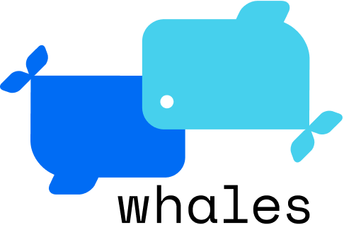
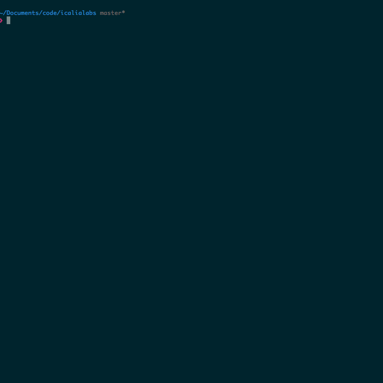

# Whales

<p align="center">
  
</p>

[](https://github.com/IcaliaLabs)
[](https://microbadger.com/images/gueils/whales "Get your own version badge on microbadger.com")
[](https://microbadger.com/images/gueils/whales "Get your own image badge on microbadger.com")

Whales helps you dockerize your applications by outputting the necessary files to run your application with Docker. Check it out:

<p align="center">
  
</p>

---

- [Installation](#installation)
- [Usage](#usage)
  - [How does it work?](#how-does-it-work)
  - [Architecture](#architecture)
  - [Command explanation](#command-explanation)
- [Contributing](#contributing)
- [Copyright](#copyright)

## Installation

Whales is distributed and run as a Docker [image](https://hub.docker.com/r/gueils/whales/), so the only thing you need is to have Docker [installed](https://docs.docker.com/engine/installation/) and running on your machine. After that just fire up your terminal and run:


```console
docker pull gueils/whales:latest
```

And that's it! You're ready to use Whales!

## Usage

Here's where the magic begins, first of all in your terminal go to the project directory you want to dockerize:

```console
cd code/path_to_project/
```

And then just execute the following command:

```console
docker run \
  --interactive --tty --rm \
  --env API_BASE_URI=whales.herokuapp.com \
  --env BELUGAS_CODE="${PWD}" \
  --volume /var/run/docker.sock:/var/run/docker.sock \
  --volume $(pwd):/code gueils/whales:latest
```

By default this command will return `dev.Dockerfile` & `docker-compose.yml` files, these are the files you need to run your application in a dev environment with Docker. These files are not perfect, but we're hoping them to be a great starting point for you.

If you need the files for a production environment, run the following command: 

```console
docker run \
  --interactive --tty --rm \
  --env API_BASE_URI=whales.herokuapp.com \
  --env BELUGAS_CODE="${PWD}" \
  --volume /var/run/docker.sock:/var/run/docker.sock \
  --volume $(pwd):/code gueils/whales:latest whales tame -e="production"
```

Until now, this command only returns the `Dockerfile` for production.

### How does it work?

Whales works as a command line interface based on features analyzers, these analyzers can detect multiple features on your project through a code static analysis, in other words, thanks to these analyzers we can detect what language, framework, database and other dependencies your project uses.

Currently, we have four feature analyzers: 

- [Belugas Ruby](https://github.com/gueils/belugas-ruby)
- [Belugas PHP](https://github.com/gueils/belugas)
- [Belugas Python](https://github.com/gueils/belugas-python)
- [Belugas Node](https://github.com/gueils/belugas-node)

The above implies we only support 4 languages: Ruby, PHP, Node(JS) & Python

### Architecture

The architecture is simple, it is composed of a flow chain of micro-apps that work together to dockerize your project, we call these "Whales and Belugas Team", this is the outline they follow:

1. The command you send on the terminal conveys a signal to Whales, so he can start the process of dockerizing your application.
2. Whales ask his bud [Belugas](https://github.com/Gueils/belugas) the features of your project. [Belugas](https://github.com/Gueils/belugas) is the head member of the Belugas Team: _The Feature Detector Team :whale:_
3. [Belugas](https://github.com/Gueils/belugas) starts by calling his smarty-pants bud, [linguistic](https://github.com/Gueils/belugas-linguist) to find out the primary language your project is using.
4. Depending on this language, [liguistic](https://github.com/Gueils/belugas-linguist) will ask one of his other buddies: [belugas-ruby](https://github.com/Gueils/belugas-ruby), [belugas-php](https://github.com/Gueils/belugas-php) or [belugas-python](https://github.com/Gueils/belugas-python) to search specific information in your repo.
5. When they're done, these fellows will send back the information founded (features) to the main [Belugas](https://github.com/Gueils/belugas).
6. [Belugas](https://github.com/Gueils/belugas) will send the features to Whales.
7. Whales will receive the features and used them along with his intelligence to build the need it Docker files
8. Finally, Whales will display the files on the terminal.

### Command explanation

Above command is a bit hard to digest at first glance, so here's a breakdown of what the options of the command are meant for:

- `--interactive --tty --rm`: This tells Docker to run in an interactive mode and to clean up the container when it exits.
- `--env API_BASE_URI=whales.herokuapp.com` & `env BELUGAS_CODE="${PWD}"`: This sets two environment variables, the first one tell Whales where to find our secret sauce, and the other one points out the code to analyze.
- `volume /var/run/docker.sock:/var/run/docker.sock`: This allows us to run Docker commands inside of a container (since all Belugas are also docker images).
- `volume $(pwd):/code gueils/whales`:  This finally mounts a volume with the code of your application.

### What's with the cetacean name?

Well, they're really cool [animals](https://en.wikipedia.org/wiki/Beluga_whale)! :whale: :whale2: :dolphin:

## Contributing

Everyone is freely to collaborate, just make sure you follow our [code of conduct](https://github.com/gueils/whales/blob/master/CODE_OF_CONDUCT.md). Thank you [contributors](https://github.com/gueils/whales/graphs/contributors)!

### Create an Issue

Find a bug and don't know how to fix it? Have trouble following the documentation or have a question about the project? Then. by all means please [create an issue](https://github.com/gueils/whales/issues/new).

Just please make sure you check [existing issues](https://github.com/gueils/whales/issues) to see if what you're running into has been addressed already.

### Submit a Pull Request

That's great! Just follow this steps:

1. Create a separate branch for your edits
2. Make sure your changes don't break the project by running your changes against current specs. **We love tests!** so it'll be even better if you create new ones when needed
3. Open your pull request against `master`

Once you've created a pull request, maintainers will chime in to review your proposed changes and to merged it if everything is right :tada:

### I want to contribute but don't know where to start

That's great also! We already have some [open issues](https://github.com/gueils/whales/issues) for you to dive in.

## Copyright

See [LICENSE](https://github.com/gueils/whales/blob/master/LICENSE.txt)


Whales is maintained with love by [Icalia Labs](http://www.icalialabs.com/team)
